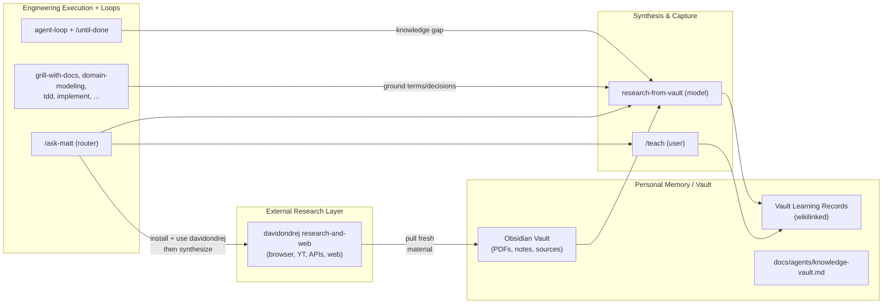

## Overview
Integrate davidondrej/skills (primarily its research-and-web capabilities) with the mattpocock/skills stack plus loop engineering to form a complete "optimal brain": durable personal memory (Obsidian vault + learning records), external sensing/ingestion, synthesis, and disciplined engineering execution with autonomous loops.

This plan implements the pending Knowledge Vault layer (as prerequisite) and wires external research ingestion explicitly, using recipes + routing updates (per clarified scope: full vault + recipes/prose only, plus a high-level brain doc). All changes follow existing patterns from setup-agent-loops, ask-matt, teach, CLAUDE.md rules, and invocation.md.

## Layered Brain Architecture (after changes)



## Concrete Implementation Steps

### 1. Create new shareable productivity skills (implement vault layer + davidondrej-aware recipes)
- `skills/productivity/setup-knowledge-vault/SKILL.md` (user-invoked, `disable-model-invocation: true`)
  - Prompt-driven like `setup-agent-loops`: Explore (detect obsidian paths or ask), present sections A–D one-by-one (Vault location, Learning record conventions, Source/PDF handling, Integration points).
  - Write `docs/agents/knowledge-vault.md` from a template.
  - Append `## Knowledge & Research` section (or subsection) to `CLAUDE.md` (or `AGENTS.md` if present; never create the opposite).
  - Include 4 recipes in `recipes/` (modeled exactly on `skills/engineering/setup-agent-loops/recipes/*.md`):
    - `ingest-sources-to-learning-records.md`
    - `research-topic-in-vault.md`
    - `maintain-vault-indexes-and-links.md`
    - `ingest-external-research-to-vault.md` (NEW — specific to this integration: "Use installed davidondrej research-and-web skills to fetch browser/YT/web results on X; save raw or summarized sources as vault notes/PDF companions; then run research-from-vault or /teach to synthesize into wikilinked learning records. Example: `/loop 30m ...` or `/until-done Research X from external + vault sources`.")
- `skills/productivity/setup-knowledge-vault/knowledge-vault-template.md` (seed for `docs/agents/knowledge-vault.md`; cover path, naming/Title Case + wikilinks, PDF companion notes, indexing, how teach/research/loops consume it, and "External ingestion via davidondrej research-and-web").
- `skills/productivity/research-from-vault/SKILL.md` (model-invoked)
  - Rich description with triggers: "research using my vault", "consult knowledge vault", "synthesize from PDFs and notes", "look up in personal sources".
  - Reads `docs/agents/knowledge-vault.md` (fallback to personal/obsidian-vault patterns or ask).
  - Supports vault-local PDFs (via companions), notes, transcripts, and previously ingested external material.
  - Produces wikilinked vault notes + learning-record style entries.
  - Explicitly notes: "When fresh external data is needed, first use davidondrej research skills (if installed), land results in the vault, then synthesize."

### 2. Update teach for vault bridge + local/vault resources
- `skills/productivity/teach/SKILL.md`: Add "Vault Integration" section. When `docs/agents/knowledge-vault.md` present, after local learning records, offer/emit vault-ready versions (Title Case, wikilinks at bottom, cross-links). Update RESOURCES guidance to accept local vault paths + PDFs (via companion notes). Mention external research can populate RESOURCES via davidondrej then vault.
- `skills/productivity/teach/LEARNING-RECORD-FORMAT.md`: Add "Vault Learning Records" section with placement, naming, wikilink, companion-to-source, and index note conventions. Cross-ref to `docs/agents/knowledge-vault.md`.
- `skills/productivity/teach/RESOURCES-FORMAT.md`: Add "Local / Vault Sources" examples (PDFs, vault notes, transcripts). Support "Local / Vault" grouping. Add annotation guidance for ingested external material.

### 3. Update routing and awareness (`ask-matt`)
- `skills/engineering/ask-matt/SKILL.md`:
  - Add new top-level section after "Agent loops": "## Knowledge, Research & Learning".
  - Cover:
    - `/teach` for multi-session learning (local workspace + vault bridge when configured).
    - `/setup-knowledge-vault` (run once; prerequisite for rich research).
    - `research-from-vault` (model-invoked; synthesis from vault sources).
    - External ingestion: install davidondrej/skills (focus research-and-web), use its skills to pull web/browser/YT, save to vault, then synthesize.
    - Maintenance via Cursor `/loop` + recipes from setup-knowledge-vault.
    - When to reach: knowledge gaps in engineering work → research-from-vault; wanting durable personal knowledge → teach + vault; fresh world info → davidondrej then vault.
  - Add table: Situation | Reach for.
  - Update "Standalone" and "Precondition" to reference the new setup.
  - Cross-link to the new brain doc.

### 4. Wire reach-for-vault into existing loops and engineering skills
- `skills/engineering/agent-loop/SKILL.md`: In knowledge-gap step or "when stuck on concepts", reach for `research-from-vault`. Support goals like "research X until synthesis note + learning record exists in vault".
- `skills/engineering/until-done/SKILL.md`: Same; document "research until X is in vault" as valid goal.
- `skills/engineering/domain-modeling/SKILL.md` and `skills/engineering/grill-with-docs/SKILL.md`: Add note: "When a knowledge vault is configured (see `docs/agents/knowledge-vault.md`), consult vault sources (directly or via `research-from-vault`) to ground terminology and decisions."
- `skills/in-progress/decision-mapping/SKILL.md`: In "Research" ticket type description, add: "When vault configured, prefer vault sources (PDFs/notes) first; use external research tools only for gaps."

### 5. Personal skill note (non-breaking)
- `skills/personal/obsidian-vault/SKILL.md`: Add short header note: "This is the low-level personal vault implementation. For research/engineering use and configuration, prefer the shareable skills in `productivity/` (`/setup-knowledge-vault`, `research-from-vault`) and `docs/agents/knowledge-vault.md`."

### 6. High-level brain architecture document (new)
- `docs/agents/brain.md` (or `BRAIN.md` at root if preferred for visibility):
  - Describe the optimal brain: Vault as long-term memory (personal + configured), davidondrej research-and-web as external eyes, research-from-vault + teach as synthesis/capture, mattpocock engineering skills + agent-loop/until-done as hands, ask-matt as router.
  - Quickstart for combined stack.
  - Mermaid diagram (similar to above).
  - Links to `docs/agents/loops.md`, `docs/agents/knowledge-vault.md`, ask-matt, teach formats.
  - Installation order: mattpocock, davidondrej (selective), run the three setups.

### 7. Housekeeping (per CLAUDE.md rules)
- `skills/productivity/README.md`: Add under User-invoked: `- **[setup-knowledge-vault](./setup-knowledge-vault/SKILL.md)** — Configure personal knowledge vault (location, learning records, PDFs, vault integration for research & teach).` Under Model-invoked: `- **[research-from-vault](./research-from-vault/SKILL.md)** — Reusable research and synthesis from the configured vault (supports ingested external sources).`
- Top-level `README.md` (Reference > Productivity): Add the two entries (same split User/Model).
- `.claude-plugin/plugin.json`: Add `"./skills/productivity/setup-knowledge-vault", "./skills/productivity/research-from-vault"` to the skills array (keep alphabetical or logical grouping).
- `CLAUDE.md`: Add
  ```
  ## Knowledge & Research
  Personal knowledge vault configuration, learning record placement, PDF/source handling, and research-from-vault flows. See `docs/agents/knowledge-vault.md`. External research ingestion uses davidondrej research-and-web skills feeding the vault.
  ```
  Place after or alongside the existing "## Agent loops" section.
- New changeset: `.changeset/optimal-brain-davidondrej-vault.md` (minor bump) describing the addition of vault layer + davidondrej integration points.
- If bucket READMEs or other references mention skills, keep consistent (no other changes expected).
- Update `CONTEXT.md` or `docs/invocation.md` only if a new term is introduced (unlikely).

### 8. Dogfood + verification
- In this repo (or a test workspace): run the new `/setup-knowledge-vault`.
- Take or simulate a `/teach` session; bridge at least one learning record into vault form (wikilinked note + index).
- Run a small research example using recipe: ingest (simulated or real davidondrej output) → `research-from-vault` or `/until-done` → produce synthesis + learning record in vault shape.
- Produce sample `docs/agents/knowledge-vault.md` (committed or noted) and an example vault note.
- Update `docs/agents/brain.md` with the actual output paths.
- Execute reinstall for Cursor:
  ```powershell
  npx skills add mattpocock/skills -g -a cursor -y -s setup-knowledge-vault -s research-from-vault
  # Separately for external research:
  npx skills add davidondrej/skills -g -a cursor
  ```
  (User selects research-and-web category at minimum.)
- Verify: new skills appear in `/ask-matt`, agent can reach `research-from-vault` in loops, `docs/agents/knowledge-vault.md` and `docs/agents/brain.md` exist and are referenced, CLAUDE.md and READMEs are updated, no linter issues on new SKILL.md frontmatter.

### 9. Installation & user guidance (document in ask-matt, brain doc, and README quickstart notes)
- User installs both repos via npx skills (mattpocock first for engineering base, davidondrej for research reach).
- Run order: `/setup-matt-pocock-skills` → `/setup-agent-loops` → `/setup-knowledge-vault`.
- Selective install recommended for davidondrej: research-and-web is highest value; evaluate agent-orchestration vs existing loop engineering; thinking-and-docs may overlap with grill/teach.
- In any research goal, prefer: vault first (recency + personal context) → external only for gaps.

## Key Patterns to Follow (do not deviate)
- All new SKILL.md files use the exact frontmatter style (name, description; disable only for user-invoked).
- Setup is interactive/prompt-driven, one section at a time, writes config + updates CLAUDE/AGENTS.
- Recipes are short, copy-paste ready, use `/loop` and `/until-done` with references to the docs/agents/ file.
- Model-invoked skills have rich trigger phrasing in description.
- References between skills use `/skill-name` prose, not deep relative paths.
- New shareable skills go in productivity/ (or engineering/), appear in bucket README + top README + plugin.json.
- personal/ remains for user-specific non-promoted things.
- Follow docs/invocation.md strictly.

## Out of Scope (for this plan)
- Moving personal/obsidian-vault out of personal/.
- Copying or forking davidondrej code into this repo (composition via separate install + recipes only).
- Full PDF text extractor binary (use companion .md + user shell commands as documented in vault config).
- Cloud cron (use Cursor /loop + local).
- Changes to prior loop-engineering files beyond the reach-for-vault prose additions.

This produces a complete, usable, and documented optimal brain while staying true to the existing skill architecture and rules.
