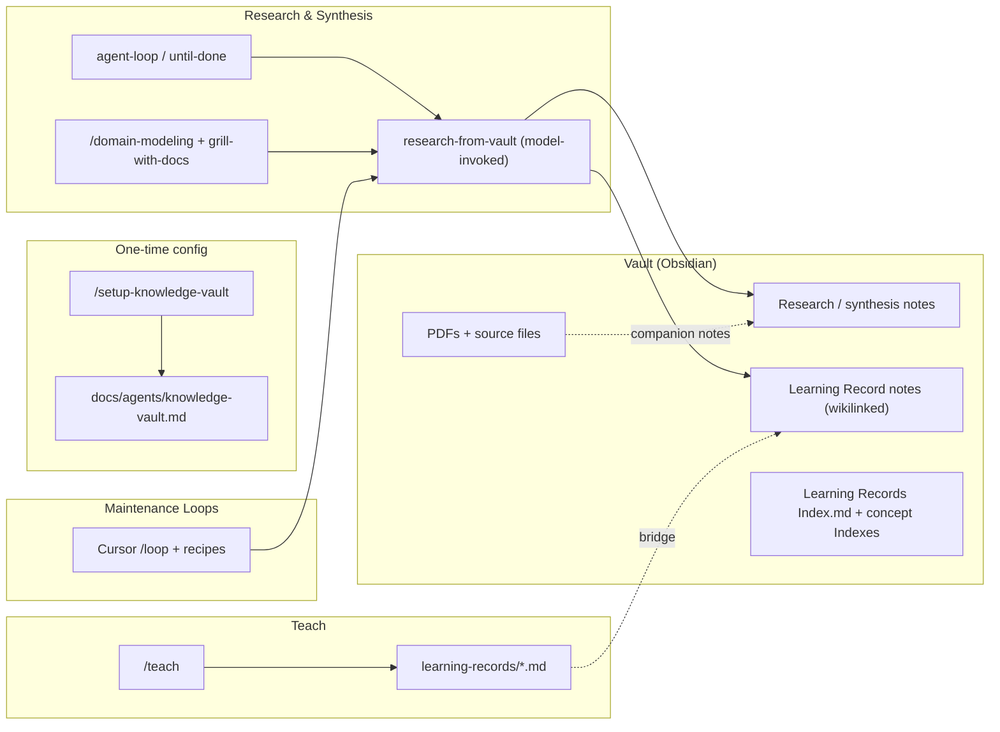

# Knowledge Vault + Teach Learning Records Integration

## Goal

Make the personal Obsidian vault the permanent home for teach learning records and the primary source of raw material (PDFs, links, transcripts, articles, notes) for personal research and engineering work. Follow the full scope discussed: new shareable skills in `productivity/`, keep `obsidian-vault` in `personal/`, full setup + research skill + teach bridge + loop recipes + housekeeping + dogfood + reinstall.

New flow (high level):



## What we add (new shareable skills in productivity/)

Following patterns from `setup-agent-loops/SKILL.md`, `setup-matt-pocock-skills/SKILL.md`, `docs/invocation.md`, and `ask-matt`.

### 1. `setup-knowledge-vault` (user-invoked, productivity/)

Path: `skills/productivity/setup-knowledge-vault/`

Prompt-driven per-vault (or per-workspace) setup. Mirrors the explore/present/confirm/write style.

Sections (one at a time):
- A — Vault location & access (generalize the hardcoded path in personal/obsidian-vault; support discovery or explicit config).
- B — Research & learning record conventions (where learning records live in vault, naming: Title Case + optional 0001- prefix, wikilink rules, Index notes).
- C — Source handling (PDFs, local files, links): companion note rules, extraction guidance (e.g. shell + proxy .md), how RESOURCES.md entries can point to vault items.
- D — Integration (how teach, research-from-vault, agent loops, decision-mapping Research tickets consume the vault).

Writes:
- `docs/agents/knowledge-vault.md` (seed from `knowledge-vault-template.md` in the skill folder). Include:
  - Vault path (configurable)
  - Learning record placement & format in vault (cross-ref to updated LEARNING-RECORD-FORMAT)
  - PDF / attachment handling (companion notes, [[embed]] or link rules)
  - Research note conventions
  - Starter recipes list
- `## Knowledge & Research` (or `### Knowledge & Research`) block in `CLAUDE.md` / `AGENTS.md` (same file selection rules as other setup skills). If `## Agent skills` or `## Agent loops` exists, nest appropriately.

Includes 3–4 recipes (copy-paste + loop examples):
- `recipes/ingest-sources-to-learning-records.md`
- `recipes/research-topic-in-vault.md`
- `recipes/maintain-vault-indexes-and-links.md`
- `recipes/process-inbox-overnight.md` (for use with Cursor `/loop`)

### 2. `research-from-vault` (model-invoked, productivity/)

Path: `skills/productivity/research-from-vault/`

Reusable discipline for active research/synthesis using the vault as primary source.

- Model-facing description with rich triggers: "research X using my vault", "consult the knowledge base", "look up in personal notes/PDFs", "synthesize from vault sources".
- Reads `docs/agents/knowledge-vault.md` (if present) for path + conventions; falls back to asking or using obsidian-vault patterns.
- Supports local files in vault (PDFs via extraction or companion .md, transcripts, articles, user notes).
- Produces (or updates) vault notes + learning-record-style entries when appropriate.
- Reachable by prose invocation from: `agent-loop`, `until-done`, `teach`, `domain-modeling`, `grill-with-docs`, `decision-mapping` (Research tickets), and direct user use.
- Completion: clear synthesis + wikilinked notes created/updated in vault, or explicit brief when stuck.

### 3. Optional thin user-invoked helper in productivity/ (e.g. `knowledge-vault`)

If direct management beyond the existing personal `obsidian-vault` is needed for research flows (search/create research notes, link, manage indexes), add a thin `knowledge-vault` user-invoked skill in productivity/ that generalizes the patterns for knowledge work (while leaving the original personal skill untouched).

## Updates to existing skills & formats

- `skills/productivity/teach/SKILL.md`: When `docs/agents/knowledge-vault.md` exists, after creating learning records, also emit (or offer to emit) vault-ready versions following vault naming + wikilink conventions. Update RESOURCES handling to support vault-local paths and local files/PDFs (not just remote links). Update "Knowledge" section guidance.
- `skills/productivity/teach/LEARNING-RECORD-FORMAT.md`: Add vault placement guidance (Title Case note, wikilinks at bottom, cross-link to MISSION and related vault notes, optional companion to source files). Add section on "Vault Learning Records".
- `skills/productivity/teach/RESOURCES-FORMAT.md`: Support local vault entries + annotation for PDFs/transcripts. Add example for vault sources. Add "Local / Vault" grouping possibility.
- `skills/engineering/ask-matt/SKILL.md`: Add or expand "Knowledge, Research & Learning" section (parallel to "Agent loops"). Cover `/teach`, vault research, setup, maintenance loops, and when to reach `research-from-vault`.
- `skills/in-progress/decision-mapping/SKILL.md`: In Research ticket description, mention that when a knowledge vault is configured, prefer vault sources first.
- `skills/engineering/domain-modeling/SKILL.md` and `grill-with-docs`: Add prose note that when vault is configured, sources in the vault (via `research-from-vault` or direct) may be used to ground terminology/decisions.
- `skills/engineering/agent-loop/SKILL.md` and `until-done`: Add that `research-from-vault` is a valid reach for knowledge gaps during loops. Support "research until synthesis is in vault" as a goal.
- `skills/personal/obsidian-vault/SKILL.md`: Add note at top that it is the base implementation; the productivity skills provide the research/engineering layer and vault config. Do not change core behavior.

## New config & templates

- `skills/productivity/setup-knowledge-vault/knowledge-vault-template.md` (seed for `docs/agents/knowledge-vault.md`).
- Update or add `docs/agents/knowledge-vault.md` on dogfood (see below).

Example content areas for the template (modeled on `docs/agents/loops.md` and `setup-agent-loops/loops-template.md`):
- Vault path
- Learning record location & naming in vault
- PDF / source handling (companion notes, extraction commands if available)
- Indexing & linking rules
- How teach + research + loops should use it

## Housekeeping (required by CLAUDE.md)

- `skills/productivity/README.md`: Add the new skills under User-invoked (setup-knowledge-vault) and Model-invoked (research-from-vault). Update descriptions.
- Top-level `README.md`: Add entries under Productivity (same split).
- `.claude-plugin/plugin.json`: Register the new paths.
- `CLAUDE.md`: Add or update Knowledge & Research section (parallel to Agent loops).
- New changeset (minor) describing the addition.
- If any bucket README or top-level entry references change, keep consistent.

## Loop recipes & maintenance (reuse loop engineering)

Add recipes that use Cursor `/loop`, `agent-loop`, and `until-done` (exactly as `setup-agent-loops/recipes/` pattern).

Examples:
- Ingest new sources (PDFs dropped in vault) → extract/synthesize → create or update learning record note + links.
- Research a question using only vault → produce synthesis note + learning record entry → stop when brief is ready.
- Periodic vault hygiene (update indexes, link orphans, prune superseded records).

These go in `skills/productivity/setup-knowledge-vault/recipes/`.

## Dogfood

After skills written:
- Run `/setup-knowledge-vault` (on a test workspace or this repo's context).
- Take one existing or new `/teach` session, produce a learning record, and bridge it into the vault as a proper wikilinked note.
- Use `research-from-vault` + `until-done` or `/loop` for a small research task against vault sources.
- Produce an example `docs/agents/knowledge-vault.md` (or note how it would look) and a sample learning record note in the repo for others to see the output shape.

## Reinstall for Cursor

```powershell
npx skills add mattpocock/skills -g -a cursor --copy -y -s setup-knowledge-vault -s research-from-vault
# plus any thin knowledge-vault helper if created
```

Restart Cursor / new Agent chat. Existing `obsidian-vault` remains available via personal path if already linked.

## How it all composes (user flow after build)

1. Once: `/setup-knowledge-vault` (writes config + CLAUDE section).
2. For learning: `/teach` → learning records produced locally + (when configured) vault versions created with wikilinks.
3. For research/engineering: `/until-done Research X using my vault` or direct reach for `research-from-vault` inside an `agent-loop`. Sources can be PDFs, notes, links already in the vault.
4. Maintenance: `/loop 1d process new material in vault into learning records and linked notes` using a recipe.
5. Routing: `/ask-matt` surfaces the knowledge flow.
6. Cross-use: decision-mapping Research tickets, domain-modeling, and grill-with-docs can pull from vault when relevant.

## Out of scope for this build

- Moving the original `obsidian-vault` skill out of `personal/` (per decision).
- Cloud scheduling (use Cursor `/loop` + local for now).
- Full PDF text extraction tool (document companion note + shell extraction pattern; actual tool choice left to user's environment).
- Changes to the prior loop-engineering plan file.

## Todos (to track)

- Create `setup-knowledge-vault` (SKILL.md + template + 4 recipes)
- Create `research-from-vault` (model-invoked skill)
- Update teach + its 2 format files for vault bridge + local resources/PDFs
- Update LEARNING-RECORD-FORMAT and RESOURCES-FORMAT with vault guidance
- Add/update skills in productivity/README.md
- Update top README.md, plugin.json, CLAUDE.md
- Integrate routing in ask-matt
- Add prose reach points in agent-loop, until-done, domain-modeling, grill-with-docs, decision-mapping
- Add changeset
- Dogfood: run setup, bridge a learning record, example research loop, produce sample docs/agents/knowledge-vault.md
- Reinstall instructions + verification

All paths and patterns must mirror existing code exactly (e.g. prompt-driven setup process, file selection for CLAUDE/AGENTS, recipe style, invocation rules).