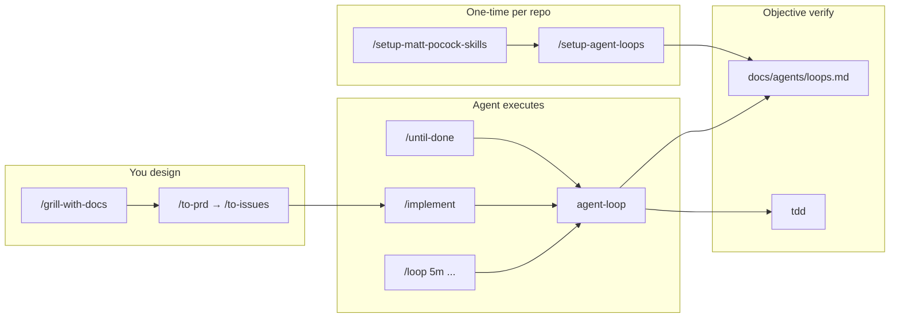

# Loop Engineering Stack for Cursor

## Goal

Ship a **loop engineering layer** that sits on top of the Matt Pocock skills you already installed. You design the goal, verifier, and stop rules once per repo; the agent runs **Plan → Act → Observe → Verify → Stop** without you prompting every step. Cursor's built-in [`/loop`](C:\Users\chidi\.cursor\skills-cursor\loop\SKILL.md) handles time-based recurrence; these new skills handle **goal-based** and **turn-based** loops with objective verification.



## What we will add (2 new skills)

Following repo conventions from [docs/invocation.md](docs/invocation.md) and the pattern in [setup-matt-pocock-skills/SKILL.md](skills/engineering/setup-matt-pocock-skills/SKILL.md):

### 1. `setup-agent-loops` (user-invoked)

**Path:** `skills/engineering/setup-agent-loops/`

Prompt-driven per-repo setup (not a script). Mirrors the three-section interview style of setup-matt-pocock-skills:

| Section | What it configures |
|---------|-------------------|
| **A — Verification** | Detect `package.json` scripts (`test`, `typecheck`, `lint`, `build`); confirm commands the agent runs after every change |
| **B — Stop rules** | Iteration cap (default 5), no-progress threshold (same failure 3×), forbidden paths (CI, `.env`, deploy), human checkpoints (before push/merge) |
| **C — Scope** | Default editable paths; optional scalar metric for optimization loops |

**Writes:**
- `docs/agents/loops.md` — full loop policy (seed from `loops-template.md`)
- `## Agent loops` block in `CLAUDE.md` or `AGENTS.md` (same file-selection rules as setup-matt-pocock-skills)

**Includes starter recipes** (copy-paste prompts, not auto-run):

| Recipe file | Purpose |
|-------------|---------|
| `recipes/build-test-fix.md` | `/loop 5m` + agent-loop until green |
| `recipes/implement-issue.md` | Fresh session + `/implement` + until-done |
| `recipes/scheduled-triage.md` | `/loop 1h /triage` after setup-matt-pocock-skills |
| `recipes/pr-until-mergeable.md` | Cursor `babysit` + loop stop rules |

### 2. `agent-loop` (model-invoked)

**Path:** `skills/engineering/agent-loop/`

The reusable **Plan → Act → Observe → Verify → Stop** discipline. Model-facing description with triggers: "loop until", "iterate until tests pass", "keep fixing until green", "run until done".

**Core loop (in SKILL.md):**

1. **Plan** — read goal, `docs/agents/loops.md`, `CONTEXT.md`; state done-signal
2. **Act** — one bounded change (vertical slice)
3. **Observe** — run verifier command(s) from loops.md
4. **Verify** — pass/fail against objective output
5. **Stop or continue** — apply stop rules from [STOP-RULES.md](skills/engineering/agent-loop/STOP-RULES.md)

**Integrations (prose invocation, not cross-folder links):**
- Reach for `/tdd` when building features test-first
- Reach for `/diagnosing-bugs` when verification fails without a clear fix path
- Read `docs/agents/loops.md` silently; if missing, use conservative defaults and suggest `/setup-agent-loops`

**Completion criterion:** verifier passes OR a stop rule fires with an explicit brief to the user.

### 3. `until-done` (user-invoked)

**Path:** `skills/engineering/until-done/`

Cursor's equivalent of Claude Code `/goal` — explicit handoff of the **stop condition**.

User invokes with a goal: `/until-done fix the failing test in user_service_test.ts`

Skill body: parse goal → confirm verifier from `docs/agents/loops.md` → run the `agent-loop` discipline until stop → present a **brief** (what changed, verifier output, why stopped).

---

## Integrations with existing skills

| File | Change |
|------|--------|
| [ask-matt/SKILL.md](skills/engineering/ask-matt/SKILL.md) | Add **Agent loops** section: when to use `/setup-agent-loops`, `/until-done`, Cursor `/loop`, and how they connect to `/implement` |
| [implement/SKILL.md](skills/engineering/implement/SKILL.md) | Add: read `docs/agents/loops.md`; use agent-loop stop rules; iterate until verifier green within iteration cap |
| [setup-matt-pocock-skills/SKILL.md](skills/engineering/setup-matt-pocock-skills/SKILL.md) | Step 5 "Done" — recommend `/setup-agent-loops` as optional follow-up |

**Not in scope for v1:** promoting [loop-me](skills/in-progress/loop-me/SKILL.md) (different purpose — life/workflow spec grilling). Mention it in ask-matt standalone as "design a custom recurring workflow."

---

## Repo housekeeping (required by [CLAUDE.md](CLAUDE.md))

- [README.md](README.md) — add 3 entries under Engineering (user-invoked: `setup-agent-loops`, `until-done`; model-invoked: `agent-loop`)
- [skills/engineering/README.md](skills/engineering/README.md) — same
- [.claude-plugin/plugin.json](.claude-plugin/plugin.json) — register all 3 paths
- **Changeset** — new minor changeset for the 3 skills

---

## Dogfood on this repo

After skills are written, run `/setup-agent-loops` against the skills repo itself:

- **Verifier:** `npm run changeset` / lint scripts if any; minimal policy since this is a skills-only repo
- **Output:** `docs/agents/loops.md` + `## Agent loops` in [CLAUDE.md](CLAUDE.md)

This gives you a working example to copy into app repos.

---

## Reinstall for your Cursor setup

Re-run global install so `~/.agents/skills/` picks up the new skills:

```powershell
npx skills add mattpocock/skills -g -a cursor --copy -y `
  -s setup-agent-loops -s until-done -s agent-loop
```

(Or reinstall all 21 skills if simpler.)

---

## How you will use it (after build)

1. **Once per app repo:** `/setup-matt-pocock-skills` then `/setup-agent-loops`
2. **Feature work:** `/grill-with-docs` → `/to-prd` → `/to-issues` → fresh chat per issue with `/implement`
3. **Goal-based loop:** `/until-done <clear goal with verifier>`
4. **Recurring local work:** `/loop 30m <prompt that invokes agent-loop discipline>`
5. **When unsure:** `/ask-matt`

---

## Out of scope for v1

- Cloud `/schedule` equivalent (GitHub Actions / cron) — document as future recipe only
- Karpathy autoresearch optimization loops — covered by scope section in loops.md template, not a separate skill
- Promoting `loop-me` or `review` from in-progress
