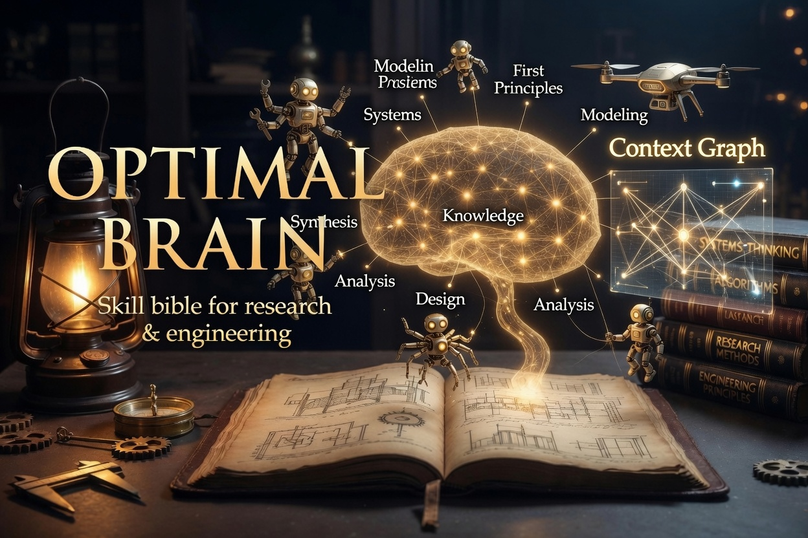
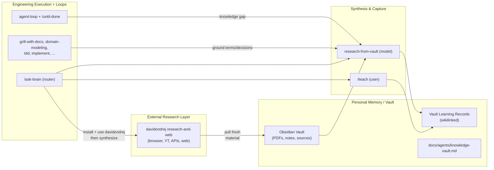

# Optimal Brain for Agentic Engineering & Research





*Layered architecture of the optimal brain (see `docs/OPTIMAL-BRAIN.md` for details).*

This is a composite "optimal brain" for agentic engineering and research. It layers the strong engineering fundamentals from `mattpocock/skills` with disciplined autonomous iteration via loop engineering and durable personal memory via a knowledge vault. External research capabilities (from `davidondrej/skills`) feed the vault, and synthesis tools turn fresh and stored knowledge into lasting learning records. See `docs/OPTIMAL-BRAIN.md` for the full architecture and comparison. **New to the stack?** Follow [docs/PLAYBOOK.md](./docs/PLAYBOOK.md) for a step-by-step research + engineering walkthrough.

These skills are designed to be small, easy to adapt, and composable. They work with any model. They're based on decades of engineering experience. Hack around with them. Make them your own. Enjoy.

## Quickstart (30-second setup)

1. Install the core collection:

   ```bash
   npx skills@latest add chidiokoene/optimal-brain
   ```

   For external research reach (browser, web, YouTube, APIs — feeds the vault):

   ```bash
   npx skills@latest add davidondrej/skills
   ```

2. Pick the skills you want, and which coding agents you want to install them on. **Make sure you select at minimum `/setup-optimal-brain`, `/setup-agent-loops`, and `/setup-knowledge-vault`**.

3. Run the setup skills in your agent (in a repo/workspace):

   - `/setup-optimal-brain` — configure issue tracker, triage labels, and domain doc layout.
   - `/setup-agent-loops` — configure verification commands, stop rules, and scope for agent loops.
   - `/setup-knowledge-vault` — configure your Obsidian vault location, learning record bridging, PDF handling, and vault integration.

4. (Optional but powerful for research) From davidondrej/skills, select the `research-and-web` category to pull fresh material that can be synthesized into the vault.

5. Restart Cursor (or start a fresh Agent chat) and use `/ask-brain` to discover flows. Bam — you're ready to go.

### Migration

If you installed before the rebrand (when skills were named `ask-matt` and `setup-matt-pocock-skills`), reinstall:

```bash
npx skills@latest add chidiokoene/optimal-brain -y
```

Or manually rename `.agents/skills/ask-matt` → `ask-brain` and `.agents/skills/setup-matt-pocock-skills` → `setup-optimal-brain` in your project.

## Why These Skills Exist

The skills in this collection (founded on mattpocock/skills) were built to fix common failure modes seen with Claude Code, Codex, and other coding agents.

### #1: The Agent Didn't Do What I Want

> "No-one knows exactly what they want"
>
> David Thomas & Andrew Hunt, [The Pragmatic Programmer](https://www.amazon.co.uk/Pragmatic-Programmer-Anniversary-Journey-Mastery/dp/B0833F1T3V)

**The Problem**. The most common failure mode in software development is misalignment. You think the dev knows what you want. Then you see what they've built - and you realize it didn't understand you at all.

This is just the same in the AI age. There is a communication gap between you and the agent. The fix for this is a **grilling session** - getting the agent to ask you detailed questions about what you're building.

**The Fix** is to use:

- [`/grill-me`](./skills/productivity/grill-me/SKILL.md) - for non-code uses
- [`/grill-with-docs`](./skills/engineering/grill-with-docs/SKILL.md) - same as [`/grill-me`](./skills/productivity/grill-me/SKILL.md), but adds more goodies (see below)

The grilling skills are among the most popular in the collection. They help you align with the agent before you get started, and think deeply about the change you're making. Use them _every_ time you want to make a change.

### #2: The Agent Is Way Too Verbose

> With a ubiquitous language, conversations among developers and expressions of the code are all derived from the same domain model.
>
> Eric Evans, [Domain-Driven-Design](https://www.amazon.co.uk/Domain-Driven-Design-Tackling-Complexity-Software/dp/0321125215)

**The Problem**: At the start of a project, devs and the people they're building the software for (the domain experts) are usually speaking different languages.

The same tension appears with agents: they are usually dropped into a project and asked to figure out the jargon as they go. So they use 20 words where 1 will do.

**The Fix** for this is a shared language. It's a document that helps agents decode the jargon used in the project.

<details>
<summary>
Example
</summary>

Here's an example [`CONTEXT.md`](https://github.com/mattpocock/course-video-manager/blob/076a5a7a182db0fe1e62971dd7a68bcadf010f1c/CONTEXT.md) from a project using these patterns. Which one is easier to read?

- **BEFORE**: "There's a problem when a lesson inside a section of a course is made 'real' (i.e. given a spot in the file system)"
- **AFTER**: "There's a problem with the materialization cascade"

This concision pays off session after session.

</details>

This is built into [`/grill-with-docs`](./skills/engineering/grill-with-docs/SKILL.md). It's a grilling session, but that helps you build a shared language with the AI, and document hard-to-explain decisions in ADR's.

It's hard to explain how powerful this is. It might be the single coolest technique in this repo. Try it, and see.

> [!TIP]
> A shared language has many other benefits than reducing verbosity:
>
> - **Variables, functions and files are named consistently**, using the shared language
> - As a result, the **codebase is easier to navigate** for the agent
> - The agent also **spends fewer tokens on thinking**, because it has access to a more concise language

### #3: The Code Doesn't Work

> "Always take small, deliberate steps. The rate of feedback is your speed limit. Never take on a task that’s too big."
>
> David Thomas & Andrew Hunt, [The Pragmatic Programmer](https://www.amazon.co.uk/Pragmatic-Programmer-Anniversary-Journey-Mastery/dp/B0833F1T3V)

**The Problem**: Let's say that you and the agent are aligned on what to build. What happens when the agent _still_ produces crap?

It's time to look at your feedback loops. Without feedback on how the code it produces actually runs, the agent will be flying blind.

**The Fix**: You need the usual tranche of feedback loops: static types, browser access, and automated tests.

For automated tests, a red-green-refactor loop is critical. This is where the agent writes a failing test first, then fixes the test. This helps give the agent a consistent level of feedback that results in far better code.

The collection includes a **[`/tdd`](./skills/engineering/tdd/SKILL.md) skill** you can slot into any project. It encourages red-green-refactor and gives the agent plenty of guidance on what makes good and bad tests.

For debugging, it also includes a **[`/diagnosing-bugs`](./skills/engineering/diagnosing-bugs/SKILL.md)** skill that wraps best debugging practices into a simple loop.

### #4: We Built A Ball Of Mud

> "Invest in the design of the system _every day_."
>
> Kent Beck, [Extreme Programming Explained](https://www.amazon.co.uk/Extreme-Programming-Explained-Embrace-Change/dp/0321278658)

> "The best modules are deep. They allow a lot of functionality to be accessed through a simple interface."
>
> John Ousterhout, [A Philosophy Of Software Design](https://www.amazon.co.uk/Philosophy-Software-Design-2nd/dp/173210221X)

**The Problem**: Most apps built with agents are complex and hard to change. Because agents can radically speed up coding, they also accelerate software entropy. Codebases get more complex at an unprecedented rate.

**The Fix** for this is a radical new approach to AI-powered development: caring about the design of the code.

This is built in to every layer of these skills:

- [`/to-prd`](./skills/engineering/to-prd/SKILL.md) quizzes you about which modules you're touching before creating a PRD

And crucially, [`/improve-codebase-architecture`](./skills/engineering/improve-codebase-architecture/SKILL.md) helps you rescue a codebase that has become a ball of mud. It is recommended to run it on your codebase once every few days.

### Summary

Software engineering fundamentals matter more than ever. These skills represent a best effort at condensing fundamentals into repeatable practices, to help you ship the best apps of your career. Enjoy.

## Origins & Credits

This stack is a fork and extension. Honest attribution for the composite:

- **mattpocock/skills** (Matt Pocock): The foundational engineering skills — grilling sessions, domain modeling, TDD, `ask-matt` router, `teach`, `setup-matt-pocock-skills`, `to-issues`/`to-prd`, vertical slicing, codebase architecture improvement, and the overall skill taxonomy, invocation model, and philosophy. The core "hands" for day-to-day engineering come from here (unchanged in this fork; renamed entry points below).

- **Chidi** (this fork, [chidiokoene/optimal-brain](https://github.com/chidiokoene/optimal-brain)): Fork entry points `ask-brain` and `setup-optimal-brain`; the loop engineering layer (`setup-agent-loops`, `agent-loop`, `until-done`, `implement` + recipes + `.agent/context/loops.md`); the knowledge vault layer (`setup-knowledge-vault`, `research-from-vault`, research capture, `decision-mapping`, bridging updates to `teach` + formats, reach points across skills); minimal context graph; plus integrated documentation (`docs/OPTIMAL-BRAIN.md`, `docs/agents/brain.md`, `docs/PLAYBOOK.md`).

- **davidondrej/skills** (David Ondrej): Research-and-web capabilities (browser, YouTube, web search, research APIs) that provide external ingestion — fresh material that can be landed in the vault and synthesized.

- **Conceptual influences**: The broader loop-engineering mindset (design the loop, not just the prompt) discussed by Addy Osmani and others; the narrow autoresearch/Karpathy pattern (`karpathy/autoresearch` — see explicit distinction and when to use each in `docs/OPTIMAL-BRAIN.md`); emphasis on "design the loop" from Peter Steinberger, Boris Cherny, and related practitioners.

The original skills give you excellent engineering fundamentals. This fork completes the system with long-term memory (the vault), external sensing, synthesis, and disciplined autonomous iteration — while preserving the base.

See `docs/OPTIMAL-BRAIN.md` for the full layered architecture, detailed comparison, Karpathy distinction, research/PhD strengths, and core flows. For a practical **research + engineering walkthrough**, see [docs/PLAYBOOK.md](./docs/PLAYBOOK.md).

## Reference

These split on one axis — who can invoke them. **User-invoked** skills are reachable only when you type them (e.g. `/grill-me`); their job is to orchestrate. **Model-invoked** skills can be invoked by you _or_ reached for automatically by the agent when the task fits; they hold the reusable discipline. A user-invoked skill may invoke model-invoked skills, but never another user-invoked one.

This collection is extended with loop engineering, knowledge vault, and minimal context graph skills (see `docs/OPTIMAL-BRAIN.md` for architecture, credits, context graph, and research guidance).

### Engineering

Skills used daily for code work.

**User-invoked**

- **[ask-brain](./skills/engineering/ask-brain/SKILL.md)** — Ask which skill or flow fits your situation. A router over the user-invoked skills in this repo.
- **[grill-with-docs](./skills/engineering/grill-with-docs/SKILL.md)** — Grilling session that also builds your project's domain model, sharpening terminology and updating `CONTEXT.md` and ADRs inline.
- **[triage](./skills/engineering/triage/SKILL.md)** — Move issues through a state machine of triage roles.
- **[improve-codebase-architecture](./skills/engineering/improve-codebase-architecture/SKILL.md)** — Scan a codebase for deepening opportunities, present them as a visual HTML report, then grill through whichever one you pick.
- **[system-architect](./skills/engineering/system-architect/SKILL.md)** — Orchestrate solution/system architecture across competence roles into a session hub, ADRs, and delivery handoff.
- **[setup-optimal-brain](./skills/engineering/setup-optimal-brain/SKILL.md)** — Configure this repo for the engineering skills (issue tracker, triage labels, domain doc layout). Run once per repo before using the other engineering skills.
- **[setup-agent-loops](./skills/engineering/setup-agent-loops/SKILL.md)** — Configure verification commands, stop rules, and scope for agent loops. Run once per repo before `/until-done` or autonomous iteration.
- **[to-issues](./skills/engineering/to-issues/SKILL.md)** — Break any plan, spec, or PRD into independently-grabbable issues using vertical slices.
- **[to-prd](./skills/engineering/to-prd/SKILL.md)** — Turn the current conversation into a PRD and publish it to the issue tracker. No interview — just synthesizes what you've already discussed.
- **[implement](./skills/engineering/implement/SKILL.md)** — Implement a PRD or issue using agent-loop discipline until verifiers pass.
- **[prototype](./skills/engineering/prototype/SKILL.md)** — Build a throwaway prototype to flesh out a design — either a runnable terminal app for state/business-logic questions, or several radically different UI variations toggleable from one route.
- **[until-done](./skills/engineering/until-done/SKILL.md)** — Run a goal-based agent loop until verification passes or a stop rule fires — hand off the stop condition to the agent.

**Model-invoked**

- **[agent-loop](./skills/engineering/agent-loop/SKILL.md)** — Plan → Act → Observe → Verify → Stop discipline for autonomous iteration until verifiers pass or stop rules fire.
- **[diagnosing-bugs](./skills/engineering/diagnosing-bugs/SKILL.md)** — Disciplined diagnosis loop for hard bugs and performance regressions: reproduce → minimise → hypothesise → instrument → fix → regression-test.
- **[tdd](./skills/engineering/tdd/SKILL.md)** — Test-driven development with a red-green-refactor loop. Builds features or fixes bugs one vertical slice at a time.
- **[domain-modeling](./skills/engineering/domain-modeling/SKILL.md)** — Actively build and sharpen a project's domain model — challenge terms against the glossary, stress-test with edge-case scenarios, and update `CONTEXT.md` and ADRs inline.
- **[codebase-design](./skills/engineering/codebase-design/SKILL.md)** — Shared discipline and vocabulary for designing deep modules: a lot of behaviour behind a small interface, placed at a clean seam, testable through that interface.

### Productivity

General workflow tools, not code-specific.

**User-invoked**

- **[grill-me](./skills/productivity/grill-me/SKILL.md)** — Get relentlessly interviewed about a plan or design until every branch of the decision tree is resolved.
- **[handoff](./skills/productivity/handoff/SKILL.md)** — Compact the current conversation into a handoff document so another agent can continue the work.
- **[teach](./skills/productivity/teach/SKILL.md)** — Teach the user a new skill or concept over multiple sessions, using the current directory as a stateful teaching workspace.
- **[decision-mapping](./skills/productivity/decision-mapping/SKILL.md)** — Turn a loose idea into a sequenced map of investigation tickets under `.agent/context/decision-maps/`, then drive them to resolution one at a time.
- **[project-notes](./skills/productivity/project-notes/SKILL.md)** — Capture personal notes during or after research in the vault under `{ProjectFolder}/Personal Notes/`.
- **[setup-knowledge-vault](./skills/productivity/setup-knowledge-vault/SKILL.md)** — Configure personal knowledge vault (location, learning records, PDFs, context graph, project overlay, vault integration for research & teach).
- **[vault-context-canvas](./skills/productivity/vault-context-canvas/SKILL.md)** — Create or refresh an Obsidian JSON Canvas context graph in the vault (not Cursor IDE canvas).
- **[writing-great-skills](./skills/productivity/writing-great-skills/SKILL.md)** — Reference for writing and editing skills well: the vocabulary and principles that make a skill predictable.

**Model-invoked**

- **[grilling](./skills/productivity/grilling/SKILL.md)** — Interview the user relentlessly about a plan or design until every branch of the decision tree is resolved. The reusable loop behind `grill-me` and `grill-with-docs`.
- **[research-from-vault](./skills/productivity/research-from-vault/SKILL.md)** — Reusable research and synthesis from the configured vault (supports ingested external sources).

### Misc

Tools I keep around but rarely use.

- **[git-guardrails-claude-code](./skills/misc/git-guardrails-claude-code/SKILL.md)** — Set up Claude Code hooks to block dangerous git commands (push, reset --hard, clean, etc.) before they execute.
- **[migrate-to-shoehorn](./skills/misc/migrate-to-shoehorn/SKILL.md)** — Migrate test files from `as` type assertions to @total-typescript/shoehorn.
- **[scaffold-exercises](./skills/misc/scaffold-exercises/SKILL.md)** — Create exercise directory structures with sections, problems, solutions, and explainers.
- **[setup-pre-commit](./skills/misc/setup-pre-commit/SKILL.md)** — Set up Husky pre-commit hooks with lint-staged, Prettier, type checking, and tests.
