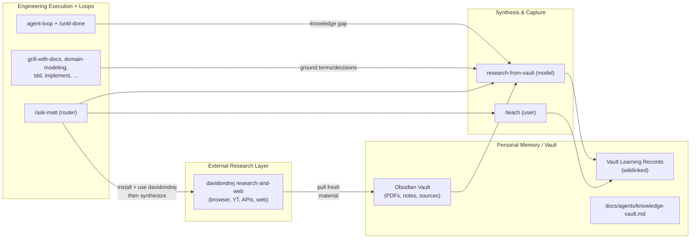

# Extended Optimal Brain

**Personal framing:** I extended the excellent `mattpocock/skills` collection because I needed stronger support for long-term research work, persistent personal knowledge across years, and autonomous iteration that doesn't require constant prompting. The original skills provide outstanding engineering fundamentals; this fork completes them with memory and research capabilities.

This stack is a layered "optimal brain" built on top of `mattpocock/skills` by adding disciplined **loop engineering** and a **personal knowledge vault** (with synthesis and external ingestion flows). It also wires in external research tools (primarily from `davidondrej/skills`) so fresh information reliably becomes durable vault knowledge.

## Layered Architecture



- **Long-term memory**: Your Obsidian vault (PDFs, notes, transcripts, learning records).
- **External sensing**: `davidondrej/skills` research-and-web (browser, YouTube, web, research APIs).
- **Synthesis & capture**: `research-from-vault` + `/teach` (with vault bridging).
- **Execution & loops**: mattpocock engineering skills + `agent-loop` / `/until-done` + verification discipline.
- **Routing**: `/ask-matt`.

## What This Fork Adds

### Loop Engineering Layer
- `skills/engineering/setup-agent-loops/` — 6 files (SKILL.md + loops-template.md + 4 recipes)
- `skills/engineering/agent-loop/` — 2 files (SKILL.md + STOP-RULES.md)
- `skills/engineering/until-done/` — 1 file (SKILL.md)

Includes `docs/agents/loops.md` (per-repo verification, stop rules, and scope).

### Knowledge Vault + External Ingestion Layer
- `skills/productivity/setup-knowledge-vault/` — 6 files (SKILL.md + knowledge-vault-template.md + 4 recipes, including the key `ingest-external-research-to-vault.md`)
- `skills/productivity/research-from-vault/` — 1 file (SKILL.md)

### Cross-Cutting Integration
- New "## Knowledge, Research & Learning" section + routing table + preconditions in `skills/engineering/ask-matt/SKILL.md`.
- Reach-for-vault prose added in: `agent-loop`, `until-done`, `domain-modeling`, `grill-with-docs`, `in-progress/decision-mapping`.
- Teach updates for vault bridging: `skills/productivity/teach/SKILL.md`, `LEARNING-RECORD-FORMAT.md`, `RESOURCES-FORMAT.md` (support for local/PDF/vault sources and external material).
- `skills/personal/obsidian-vault/SKILL.md` annotated as the low-level base implementation.
- `CLAUDE.md`, top-level `README.md`, `skills/productivity/README.md`, and `.claude-plugin/plugin.json` updated to register the new skills.
- New documentation: `docs/agents/brain.md`, `knowledge-vault.md`, plus example outputs.

**Net shipped surface change**: The plugin manifest and READMEs now expose `agent-loop`, `until-done`, `setup-agent-loops`, `setup-knowledge-vault`, and `research-from-vault` in addition to the original skills.

This is a substantial addition (new skill packages + recipes + docs + integration points) rather than minor tweaks.

## Comparison to Original `mattpocock/skills`

Matt's original strengths (still fully present and foundational here):
- Extremely strong engineering fundamentals and "idea → ship" flow.
- Excellent grilling + domain modeling + TDD + codebase architecture + vertical slicing (`to-issues`, `to-prd`, etc.).
- `ask-matt` as a very good router.
- `teach` for multi-session learning.

What this fork adds on top:

| Layer                  | Original Matt's                                      | This Fork (additions)                                                                 | Impact |
|------------------------|------------------------------------------------------|---------------------------------------------------------------------------------------|--------|
| **Memory / Second brain** | None (learning was local to teach workspaces or lost in chat) | Obsidian vault as first-class durable store + learning records + PDF companions     | High for research & long-term learning |
| **External sensing**   | None explicit                                        | Recipes + guidance to use `davidondrej/skills` (research-and-web) → land in vault → synthesize | High for staying current |
| **Autonomous iteration** | Limited (basic loops via Cursor or manual)           | `setup-agent-loops` + `agent-loop` (Plan → Act → Observe → Verify → Stop) + `/until-done` + recipes + per-repo verification/stop rules in `docs/agents/loops.md` | Very high for goal-based or recurring work |
| **Synthesis engine**   | Teach (local)                                        | `research-from-vault` (model-invoked, vault-aware, reachable from loops/engineering) | High |
| **Teach integration**  | Local learning records                               | Automatic bridging to vault + vault sources in RESOURCES                              | Medium-High |
| **Routing & awareness**| Good for engineering                                 | Expanded `ask-matt` with full Knowledge/Research section + cross-skill reach points   | Medium |
| **Architecture view**  | Implicit                                             | Explicit `docs/agents/brain.md` with layered diagram                                  | High for understanding the whole system |

The core engineering skills (grilling, domain modeling, TDD, etc.) are untouched. This fork *completes* the original by solving "where does knowledge live long-term?" and "how does the agent keep going autonomously and bring in new information?"

## Relationship to "Karpathy Loops" (the Autoresearch Pattern)

This stack is **not** the narrow "Karpathy Loop" popularized by Andrej Karpathy's `karpathy/autoresearch` (and discussed in the referenced X post).

### The Narrow Karpathy-Style Pattern
- The agent may edit only **one bounded mutable file** (classically `train.py`).
- Every experiment runs for a **fixed time budget** (commonly 5 minutes).
- Success is defined by a **single scalar metric** (e.g., `val_bpb`).
- The agent either **keeps the change** (git commit) or **reverts** (git reset) based on the metric.
- A `program.md` file acts as the high-level workflow contract.
- The loop runs autonomously (often overnight) for hundreds of small, comparable experiments.

This is an extremely effective specialized optimization engine when you have a clear, objective, quickly measurable target and a tightly bounded mutation surface.

### How This Stack Relates
This fork shares the broader philosophy ("design the loop instead of prompting the agent every turn"), but is a **general-purpose system** for engineering and research:

- Configurable (not single-file) edit scope via `docs/agents/loops.md`.
- Flexible verification (tests, typecheck, lint, structural checks, custom verifiers) instead of one scalar.
- Persistent memory (vault + bridged learning records) across sessions, days, and years.
- First-class support for research, synthesis, literature work, and multi-file projects.
- Explicit external ingestion flows that land new information into the vault.

### When to Use Which
- Use a narrow Karpathy-style loop (or apply those constraints inside a recipe/goal) for pure optimization tasks with a clear scalar and bounded surface.
- Use this stack as the base for general engineering, multi-step work, research synthesis, literature reviews, and long-running personal knowledge accumulation.
- Recommendation: Run this stack as your primary system. Apply tight Karpathy-style constraints selectively inside specific optimization sub-problems.

## Strengths for Research, PhD, and Long-Term Knowledge Work

This stack is particularly well-suited for PhD-style and research-heavy work:

- **Persistent memory across years**: The vault + learning records + wikilinks become a queryable second brain. Teach outputs and research insights are bridged out of temporary workspaces into durable notes.
- **Turning external sources into personal knowledge**: PDFs, papers, talks, and web results can be ingested (via davidondrej research tools or manually), annotated with companion notes, synthesized via `research-from-vault`, and captured as vault learning records.
- **Autonomous research loops**: Goals such as `/until-done Research X in the vault until a synthesis note and learning record exist` or maintenance recipes (`/loop 1d ...`) let the agent work while you focus elsewhere.
- **Multi-session deep learning**: `/teach` with vault integration supports building real storage strength over time instead of just fluency.
- **Grounded engineering**: `domain-modeling`, `grill-with-docs`, and decision-mapping Research tickets can consult vault sources first via `research-from-vault` reach points.
- **Clear mental model**: `docs/agents/brain.md` + the expanded `ask-matt` Knowledge section make the whole system easy to navigate and extend.

## Core Flows

- **Learning**: `/teach "topic"` → local workspace + (when vault configured) bridged vault learning records + wikilinked synthesis.
- **Research in vault**: "research X using my vault" or `/until-done Research X from the vault until synthesis note and learning record exist`.
- **Fresh world info → durable memory**: Use davidondrej research tools to fetch → save sources into vault (with companion notes) → `research-from-vault` or `/teach` to synthesize → vault learning record.
- **Engineering with memory**: `/grill-with-docs` or `domain-modeling` will ground in vault sources when present. Loops reach `research-from-vault` on knowledge gaps.
- **Maintenance**: `/loop 1d` + recipes from `setup-knowledge-vault/recipes/` (ingest, research, maintain indexes, external-to-vault).

## Quickstart + Setup Order

1. Install the collections:
   ```bash
   npx skills@latest add mattpocock/skills
   npx skills@latest add davidondrej/skills   # prefer research-and-web
   ```

2. In your main research workspace/repo, run:
   - `/setup-matt-pocock-skills`
   - `/setup-agent-loops` (verification + stop rules)
   - `/setup-knowledge-vault` (the key step for research memory)

3. (Optional but powerful) Install and select davidondrej research-and-web skills for external ingestion.

Restart Cursor / start a fresh Agent chat. Use `/ask-matt` to discover flows.

Reinstall after source changes (example):
```powershell
npx skills add mattpocock/skills -g -a cursor -y -s setup-knowledge-vault -s research-from-vault
npx skills add davidondrej/skills -g -a cursor
```

**Prefer vault first**: In any research or grounding task, consult vault sources (recency + your context + prior learning) before external. Use external tools to fill gaps, then immediately land and synthesize into the vault.

## Key Files & References

- `docs/agents/brain.md` — high-level architecture and quickstart
- `docs/agents/loops.md` — verification, stop rules, scope for agent loops
- `docs/agents/knowledge-vault.md` — vault location, conventions, PDF handling, integration rules
- `skills/engineering/ask-matt/SKILL.md` — detailed routing, especially the Knowledge, Research & Learning section
- `skills/productivity/setup-knowledge-vault/` — setup skill + recipes (including external ingestion)
- `skills/productivity/research-from-vault/SKILL.md` — reusable synthesis discipline
- `skills/productivity/teach/` (plus `LEARNING-RECORD-FORMAT.md` and `RESOURCES-FORMAT.md`) — multi-session learning with vault bridging
- `skills/engineering/setup-agent-loops/` — loop recipes and discipline
- `skills/personal/obsidian-vault/SKILL.md` — low-level vault operations (annotated as base implementation)

## Bottom Line / Philosophy

This fork does not replace Matt's engineering foundation — it completes it.

The original skills give you excellent "hands." This stack adds long-term memory (the vault), eyes on the outside world (external research ingestion), a synthesis engine, and a disciplined autonomous iteration system (loop engineering).

It is designed for people who need their agent to **remember**, **research**, and **iterate autonomously** over long periods — while still retaining strong engineering fundamentals when it's time to ship.

The durable, compounding asset is no longer just the codebase or a single conversation. It is the instructions, the vault, the learning records, and the loops you design.