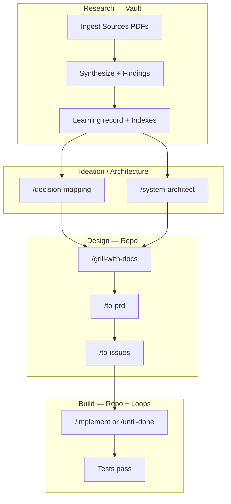

# Optimal Brain Playbook

**How to use this stack for research + engineering** — from first install through building and shipping code with a persistent vault.

For architecture and credits, see [OPTIMAL-BRAIN.md](./OPTIMAL-BRAIN.md). For config file details, see [agents/brain.md](./agents/brain.md). When unsure which skill to run, use `/ask-brain`.

## Two layers, one system

| Layer | Where it lives | What it holds |
| ----- | -------------- | ------------- |
| **Global brain** | Obsidian vault | `Sources/` (PDFs), companion notes, synthesis, learning records, Context Index, Research Sessions, Findings, decision traces, `{ProjectFolder}/Personal Notes/`, `{ProjectFolder}/Context Graph.canvas` |
| **Project brain** | Your code repo | `CONTEXT.md`, ADRs, `.agent/context/` (loops, project overlay, issue tracker, decision maps, architecture sessions) |

Research compounds in the vault. Code ships in the repo. The context graph connects them.

### Consumer repo layout (`.agent/context/`)

Per-repo agent config lives under **`.agent/context/`** — not scattered `docs/agents/` folders. Setup skills write there; skills read `.agent/context/<file>` first and fall back to legacy `docs/agents/<file>`.

```text
.agent/context/
  knowledge-vault.md       # vault path + conventions
  project-context.md       # which vault notes apply here
  loops.md                 # verifiers + stop rules
  issue-tracker.md
  triage-labels.md
  domain.md
  decision-maps/           # /decision-mapping artifacts
  architecture-sessions/   # /system-architect hubs
  decision-traces/         # optional engineering audits
```

Human-facing domain docs (`CONTEXT.md`, `docs/adr/`) stay at conventional locations. See `skills/productivity/setup-knowledge-vault/AGENT-CONTEXT-PATH.md`.

## One-time setup

### 1. Install skills

```bash
npx skills@latest add chidiokoene/optimal-brain
npx skills@latest add davidondrej/skills   # optional: external research
```

Select at minimum: `setup-optimal-brain`, `setup-agent-loops`, `setup-knowledge-vault`, `ask-brain`, `until-done`, `research-from-vault`, `decision-mapping`, `system-architect`, `project-notes`, `vault-context-canvas`, `implement`.

### 2. Open your project in Cursor

Skills install **per project** when you choose Project scope. Restart Cursor or start a fresh Agent chat after install.

### 3. Run setup skills (once per repo)

In order:

1. **`/setup-optimal-brain`** — issue tracker, triage labels, `CONTEXT.md` / ADR layout → `.agent/context/` (optionally create `architecture-sessions/`)
2. **`/setup-agent-loops`** — test/lint commands, stop rules, edit scope → `.agent/context/loops.md`
3. **`/setup-knowledge-vault`** — vault path, learning records, context graph, research capture folders → `.agent/context/knowledge-vault.md` + `.agent/context/project-context.md`

Have your Obsidian vault path ready for step 3.

### 4. Verify

- Type `/` in Agent chat — `/ask-brain`, `/setup-optimal-brain`, etc. appear
- Run `/ask-brain` and ask: "I'm starting a research + coding project — what flow should I use?"

## End-to-end workflow



### Phase A — Research

**Goal:** Turn PDFs, notes, and web material into durable knowledge the agent reuses while coding.

#### Add sources (PDFs) to the vault

Agents read files under the vault path in `.agent/context/knowledge-vault.md`. Obsidian does **not** need to be running — only the folder on disk matters. Do **not** put large PDFs in the code repo unless you intend that.

1. Confirm the vault root after `/setup-knowledge-vault` (absolute path in `.agent/context/knowledge-vault.md`).
2. Create `{VAULT}/Sources/` if it does not exist (Obsidian or File Explorer).
3. Drop PDFs into `Sources/` (drag-drop or copy).
4. Add a companion note next to each PDF, e.g. `Paper Note.md`, with `[[Paper.pdf]]` (or `![[Paper.pdf]]` to embed in Obsidian) plus key extracts or annotations.
5. Ingest with the agent (companion notes + learning records):

```
/until-done Ingest new sources in the vault under Sources/. For each PDF, create or update a companion note with key extracts and insights. Emit a vault learning record for each non-trivial insight. Update relevant Index notes. Stop when all new material has a companion note and at least one learning record per major source, or a stop rule fires.
```

Recipe: `skills/productivity/setup-knowledge-vault/recipes/ingest-sources-to-learning-records.md`

**Vault only** (you already have sources):

```
/until-done Research "topic X" using only sources in my vault. Create session hub + finding notes per RESEARCH-CAPTURE-FORMAT.md. Produce synthesis + learning record + update Context Index and Research Index. Stop when all exist with wikilinks per `.agent/context/knowledge-vault.md`.
```

**External → vault → synthesize** (need fresh material):

```
/until-done Research "topic X" using external research tools. Fetch papers/posts/videos, save to vault with companion notes, capture findings (session hub + Findings/), synthesize into wikilinked note + learning record. Stop when capture format complete per RESEARCH-CAPTURE-FORMAT.md.
```

Recipe: `skills/productivity/setup-knowledge-vault/recipes/ingest-external-research-to-vault.md`

**Deep learning over weeks:**

```
/teach "topic X"
```

Bridged learning records land in the vault when configured.

**After significant research:** update `.agent/context/project-context.md` to link vault notes that apply to this project.

**Personal notes and visual graph:**

- **`/project-notes`** — your reflections during or after research → `{ProjectFolder}/Personal Notes/` in the vault
- **`/vault-context-canvas`** — refresh Obsidian JSON Canvas at `{ProjectFolder}/Context Graph.canvas` (open in Obsidian; not Cursor IDE canvas)

### Phase A½ — Ideation (multi-session investigation)

When a loose idea has **fog of war** — open questions that need research, prototypes, or grilling across sessions:

1. **`/decision-mapping`** (bootstrap) — grilling session → map at `.agent/context/decision-maps/<slug>.md`
2. **Resume** per ticket — Research tickets use `research-from-vault` with full vault capture; Prototype → `/prototype`; Grilling → `/grilling` + `/domain-modeling`
3. When the map is done → **`/to-prd`** or direct **`/implement`**

### Phase B½ — System architecture (when design is non-trivial)

When you need multi-view solution design (domain, data, security, NFR) — not only grilling:

1. **`/system-architect`** — pick engagement (`discovery`, `as_is_review`, `target_design`, `migration`)
2. Session hub → `.agent/context/architecture-sessions/`
3. Confirm ADR drafts → write under `docs/adr/`
4. Optional: **`/vault-context-canvas`** after vault research
5. Hand off → **`/to-prd`** / **`/to-issues`**

Recipes: `skills/engineering/system-architect/recipes/`.

For code-only deepening (shallow modules), use **`/improve-codebase-architecture`** instead.

### Phase B — Design (before coding)

1. **`/grill-with-docs`** — align on what you're building; build shared language in `CONTEXT.md` and ADRs. Say "consult the vault for X" to ground in prior research.
2. **Optional:** **`/prototype`** + **`/handoff`** — throwaway code to answer "will this work?"
3. **`/to-prd`** — turn the grilled thread into a PRD (multi-session builds)
4. **`/to-issues`** — split into vertical slices (independently implementable issues)

Keep steps 1–4 in **one context window** when possible. After `/to-issues`, start a **fresh session per issue**.

### Phase C — Build

For each issue:

1. Fresh Agent session
2. **`/implement`** with issue + PRD, or:

```
/until-done Implement issue #N per the PRD. Stop when tests pass per `.agent/context/loops.md` (fallback: `docs/agents/loops.md`).
```

The agent reads: `.agent/context/loops.md` → `.agent/context/project-context.md` → `CONTEXT.md` → vault Context Index.

**Knowledge gap mid-build:**

```
Research X using my vault before implementing. Ground the approach in vault sources listed in project-context.md.
```

**TDD-heavy work:** agent reaches `/tdd` during loops when appropriate.

## Copy-paste prompts

**Ingest new PDFs under Sources/:**

```
/until-done Ingest new sources in the vault under Sources/. For each PDF, create or update a companion note with key extracts and insights. Emit a vault learning record for each non-trivial insight. Update relevant Index notes. Stop when all new material has a companion note and at least one learning record per major source, or a stop rule fires.
```

**Link research to this project:**

```
Update `.agent/context/project-context.md` to include [[My Synthesis Note]] as exploratory design input for this project.
```

**Research then code:**

```
/until-done Research "chunking strategies for academic PDFs" from my vault until synthesis + learning record exist. Then propose an implementation plan grounded in that synthesis before writing code.
```

**System architecture (target design):**

```
/system-architect target_design for hybrid RAG over vault PDFs. Write session hub under .agent/context/architecture-sessions/. Propose ADR drafts. Stop when synthesis + next step toward /to-prd exist. Do not implement code.
```

Recipes: `skills/engineering/system-architect/recipes/`.

**Build with vault grounding:**

```
/until-done Implement the retrieval module for issue #4. Before coding, consult vault sources in `.agent/context/project-context.md`. Stop when tests pass per `.agent/context/loops.md`.
```

**Full pipeline (external → vault → design):**

```
/until-done Fetch recent papers on hybrid RAG, save to vault Sources/ with companion notes, synthesize, update Context Index, then propose architecture in docs/adr/. Stop when synthesis note exists and a one-page architecture outline is in docs/adr/.
```

**Maintenance (weekly):**

```
/loop 1d Run maintain-context-graph recipe from setup-knowledge-vault. Update Context Index and reconcile project-context.md for stale links. Optionally refresh vault-context-canvas.
```

Recipe: `skills/productivity/setup-knowledge-vault/recipes/maintain-context-graph.md`

## Example: research-heavy app (knowledge graph + chatbot)

| Step | Action | Skill / artifact |
| ---- | ------ | ---------------- |
| 1 | Drop PDFs into vault `Sources/` | Manual |
| 2 | Companion notes (`[[Paper.pdf]]`) + ingest | `/until-done` + ingest-sources recipe |
| 3 | Synthesize literature (session hub + Findings) | `research-from-vault` / `/until-done` |
| 4 | Personal reflection | `/project-notes` |
| 5 | Link synthesis in project overlay | Update `project-context.md` |
| 6 | Multi-view target design (if non-trivial) | `/system-architect` |
| 7 | Refresh Obsidian context graph | `/vault-context-canvas` |
| 8 | Grill system design grounded in vault | `/grill-with-docs` |
| 9 | PRD + issues | `/to-prd` → `/to-issues` |
| 10 | Implement first slice | `/implement` or `/until-done` |
| 11 | Agent unsure about approach | "research X from vault" |
| 12 | Implement remaining slices | Fresh session per issue |
| 13 | Vault hygiene | `/loop 1d` + maintain-context-graph |

## Daily and weekly habits

| When | Do this |
| ---- | ------- |
| **Start a coding session** | Agent reads `.agent/context/project-context.md` + relevant vault notes |
| **After dropping PDFs** | Companion note + ingest recipe (then research if needed) |
| **After reading a paper** | PDF + companion note → finding notes + synthesis → learning record → Context Index + Research Index |
| **Before a big system change** | `/system-architect` (or `/decision-mapping` if fog of war) |
| **Before a big feature** | `/grill-with-docs` |
| **During / after research** | `/project-notes`; optionally `/vault-context-canvas` |
| **During build** | `/until-done` with explicit done signal |
| **Weekly** | `/loop 1d` with a vault maintenance recipe |
| **Unsure what to run** | `/ask-brain` |

## Agent read order

When research and code intersect:

1. `.agent/context/knowledge-vault.md` (fallback: `docs/agents/knowledge-vault.md`)
2. `.agent/context/loops.md` (fallback: `docs/agents/loops.md`)
3. `.agent/context/project-context.md` (fallback: `docs/agents/project-context.md`)
4. Vault Context Index
5. Wikilinked notes from the vault

## Rules of thumb

1. **Vault first for knowledge, repo first for action** — research lives in Obsidian; code decisions live in ADRs and `CONTEXT.md`.
2. **Never leave research only in chat** — capture session hub + finding notes in the vault (see RESEARCH-CAPTURE-FORMAT.md).
3. **Exploratory vault notes ≠ implementation truth** — review before coding; `confidence: exploratory` means design input only.
4. **One issue, one fresh session** — after `/to-issues`, implement slices separately.
5. **Grill before you build** — `/grill-with-docs` prevents misalignment; use `/system-architect` when multi-view design is needed.
6. **Loops need real verifiers** — `/setup-agent-loops` must match your actual test/lint commands.

## Shortest path (today)

1. Install skills in your project repo
2. Run the three setup skills (have vault path ready)
3. Drop PDFs into vault `Sources/` + companion notes
4. One research `/until-done` goal (or ingest recipe first)
5. `/grill-with-docs` (or `/system-architect` if the system design is non-trivial) for what you want to build
6. `/to-issues` then `/until-done` on the first slice

## Related

- [OPTIMAL-BRAIN.md](./OPTIMAL-BRAIN.md) — architecture, Matt comparison, Karpathy distinction
- [agents/brain.md](./agents/brain.md) — layers, quickstart, config files
- [agents/knowledge-vault.md](./agents/knowledge-vault.md) — vault rules and examples
- [skills/engineering/ask-brain/SKILL.md](../skills/engineering/ask-brain/SKILL.md) — full routing tables
- [skills/engineering/system-architect/](../skills/engineering/system-architect/) — orchestrator + [recipes/](../skills/engineering/system-architect/recipes/)
- [skills/productivity/project-notes/SKILL.md](../skills/productivity/project-notes/SKILL.md) — personal notes in vault
- [skills/productivity/vault-context-canvas/SKILL.md](../skills/productivity/vault-context-canvas/SKILL.md) — Obsidian JSON Canvas context graph
- [setup-knowledge-vault/recipes/](../skills/productivity/setup-knowledge-vault/recipes/) — ingest, research, maintain
- [setup-agent-loops/recipes/](../skills/engineering/setup-agent-loops/recipes/) — implement-issue, build-test-fix
