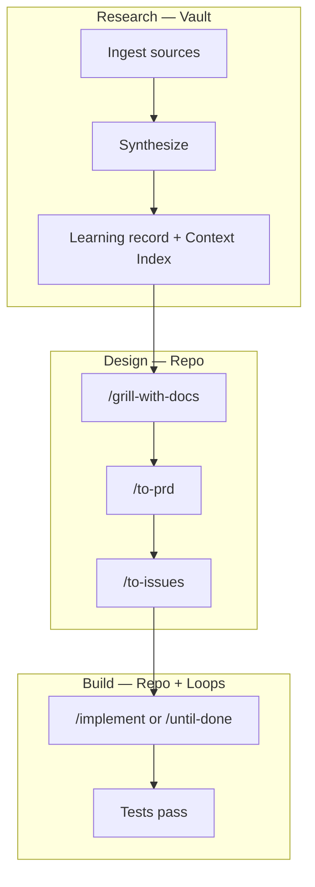

# Optimal Brain Playbook

**How to use this stack for research + engineering** — from first install through building and shipping code with a persistent vault.

For architecture and credits, see [OPTIMAL-BRAIN.md](./OPTIMAL-BRAIN.md). For config file details, see [agents/brain.md](./agents/brain.md). When unsure which skill to run, use `/ask-brain`.

## Two layers, one system

| Layer | Where it lives | What it holds |
| ----- | -------------- | ------------- |
| **Global brain** | Obsidian vault | Papers, synthesis, learning records, Context Index, decision traces |
| **Project brain** | Your code repo | `CONTEXT.md`, ADRs, `docs/agents/loops.md`, `docs/agents/project-context.md`, issues |

Research compounds in the vault. Code ships in the repo. The context graph connects them.

## One-time setup

### 1. Install skills

```bash
npx skills@latest add chidiokoene/optimal-brain
npx skills@latest add davidondrej/skills   # optional: external research
```

Select at minimum: `setup-optimal-brain`, `setup-agent-loops`, `setup-knowledge-vault`, `ask-brain`, `until-done`, `research-from-vault`.

### 2. Open your project in Cursor

Skills install **per project** when you choose Project scope. Restart Cursor or start a fresh Agent chat after install.

### 3. Run setup skills (once per repo)

In order:

1. **`/setup-optimal-brain`** — issue tracker, triage labels, `CONTEXT.md` / ADR layout
2. **`/setup-agent-loops`** — test/lint commands, stop rules, edit scope → `docs/agents/loops.md`
3. **`/setup-knowledge-vault`** — vault path, learning records, context graph → `docs/agents/knowledge-vault.md` + `docs/agents/project-context.md`

Have your Obsidian vault path ready for step 3.

### 4. Verify

- Type `/` in Agent chat — `/ask-brain`, `/setup-optimal-brain`, etc. appear
- Run `/ask-brain` and ask: "I'm starting a research + coding project — what flow should I use?"

## End-to-end workflow



### Phase A — Research

**Goal:** Turn PDFs, notes, and web material into durable knowledge the agent reuses while coding.

**Vault only** (you already have sources):

```
/until-done Research "topic X" using only sources in my vault. Produce a synthesis note + learning record + update Context Index. Stop when all three exist with wikilinks per docs/agents/knowledge-vault.md.
```

**External → vault → synthesize** (need fresh material):

```
/until-done Research "topic X" using external research tools. Fetch papers/posts/videos, save to vault with companion notes, synthesize into wikilinked note + learning record. Stop when synthesis + learning record exist in vault.
```

Recipe: `skills/productivity/setup-knowledge-vault/recipes/ingest-external-research-to-vault.md`

**Deep learning over weeks:**

```
/teach "topic X"
```

Bridged learning records land in the vault when configured.

**After significant research:** update `docs/agents/project-context.md` to link vault notes that apply to this project.

### Phase B — Design (before coding)

1. **`/grill-with-docs`** — align on what you're building; build shared language in `CONTEXT.md` and ADRs. Say "consult the vault for X" to ground in prior research.
2. **Optional:** **`/prototype`** + **`/handoff`** — throwaway code to answer "will this work?"
3. **`/to-prd`** — turn the grilled thread into a PRD (multi-session builds)
4. **`/to-issues`** — split into vertical slices (independently implementable issues)

Keep steps 1–4 in **one context window** when possible. After `/to-issues`, start a **fresh session per issue**.

### Phase C — Build

For each issue:

1. Fresh Agent session
2. **`/implement`** with issue + PRD, or:

```
/until-done Implement issue #N per the PRD. Stop when tests pass per docs/agents/loops.md.
```

The agent reads: `loops.md` → `project-context.md` → `CONTEXT.md` → vault Context Index.

**Knowledge gap mid-build:**

```
Research X using my vault before implementing. Ground the approach in vault sources listed in project-context.md.
```

**TDD-heavy work:** agent reaches `/tdd` during loops when appropriate.

## Copy-paste prompts

**Link research to this project:**

```
Update docs/agents/project-context.md to include [[My Synthesis Note]] as exploratory design input for this project.
```

**Research then code:**

```
/until-done Research "chunking strategies for academic PDFs" from my vault until synthesis + learning record exist. Then propose an implementation plan grounded in that synthesis before writing code.
```

**Build with vault grounding:**

```
/until-done Implement the retrieval module for issue #4. Before coding, consult vault sources in project-context.md. Stop when tests pass per docs/agents/loops.md.
```

**Full pipeline (external → vault → design):**

```
/until-done Fetch recent papers on hybrid RAG, save to vault, synthesize, update Context Index, then propose architecture in docs/adr/. Stop when synthesis note exists and a one-page architecture outline is in docs/adr/.
```

**Maintenance (weekly):**

```
/loop 1d Run maintain-context-graph recipe from setup-knowledge-vault. Update Context Index and reconcile project-context.md for stale links.
```

Recipe: `skills/productivity/setup-knowledge-vault/recipes/maintain-context-graph.md`

## Example: research-heavy app (knowledge graph + chatbot)

| Step | Action | Skill / artifact |
| ---- | ------ | ---------------- |
| 1 | Drop PDFs into vault `Sources/` | Manual |
| 2 | Synthesize literature | `/until-done` + vault recipe |
| 3 | Link synthesis in project overlay | Update `project-context.md` |
| 4 | Grill system design grounded in vault | `/grill-with-docs` |
| 5 | PRD + issues | `/to-prd` → `/to-issues` |
| 6 | Implement first slice | `/implement` or `/until-done` |
| 7 | Agent unsure about approach | "research X from vault" |
| 8 | Implement remaining slices | Fresh session per issue |
| 9 | Vault hygiene | `/loop 1d` + maintain-context-graph |

## Daily and weekly habits

| When | Do this |
| ---- | ------- |
| **Start a coding session** | Agent reads `project-context.md` + relevant vault notes |
| **After reading a paper** | PDF + companion note → synthesis → learning record → Context Index |
| **Before a big feature** | `/grill-with-docs` |
| **During build** | `/until-done` with explicit done signal |
| **Weekly** | `/loop 1d` with a vault maintenance recipe |
| **Unsure what to run** | `/ask-brain` |

## Agent read order

When research and code intersect:

1. `docs/agents/knowledge-vault.md`
2. `docs/agents/loops.md`
3. `docs/agents/project-context.md`
4. Vault Context Index
5. Wikilinked notes from the vault

## Rules of thumb

1. **Vault first for knowledge, repo first for action** — research lives in Obsidian; code decisions live in ADRs and `CONTEXT.md`.
2. **Never leave research only in chat** — land synthesis in the vault with wikilinks.
3. **Exploratory vault notes ≠ implementation truth** — review before coding; `confidence: exploratory` means design input only.
4. **One issue, one fresh session** — after `/to-issues`, implement slices separately.
5. **Grill before you build** — `/grill-with-docs` prevents misalignment.
6. **Loops need real verifiers** — `/setup-agent-loops` must match your actual test/lint commands.

## Shortest path (today)

1. Install skills in your project repo
2. Run the three setup skills
3. Put first PDFs/notes in the vault
4. One research `/until-done` goal
5. `/grill-with-docs` for what you want to build
6. `/to-issues` then `/until-done` on the first slice

## Related

- [OPTIMAL-BRAIN.md](./OPTIMAL-BRAIN.md) — architecture, Matt comparison, Karpathy distinction
- [agents/brain.md](./agents/brain.md) — layers, quickstart, config files
- [agents/knowledge-vault.md](./agents/knowledge-vault.md) — vault rules and examples
- [skills/engineering/ask-brain/SKILL.md](../skills/engineering/ask-brain/SKILL.md) — full routing tables
- [setup-knowledge-vault/recipes/](../skills/productivity/setup-knowledge-vault/recipes/) — ingest, research, maintain
- [setup-agent-loops/recipes/](../skills/engineering/setup-agent-loops/recipes/) — implement-issue, build-test-fix
