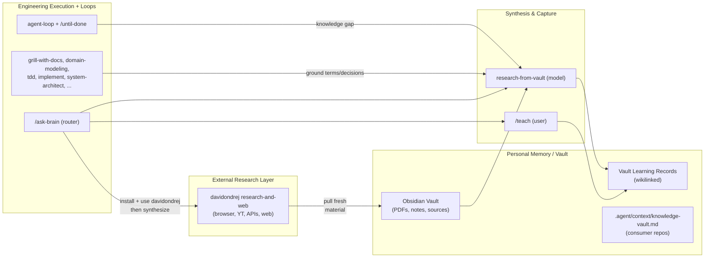

# Optimal Agent Brain

This repo + your personal vault + selective external skills form a practical "optimal brain" for agentic engineering and research.

See also `docs/OPTIMAL-BRAIN.md` for a fuller comparison to the original mattpocock/skills, the distinction from narrow Karpathy-style loops, and research/PhD-oriented guidance. For a step-by-step **usage playbook** (research → design → build), see [../PLAYBOOK.md](../PLAYBOOK.md).

- **Long-term memory**: Your Obsidian vault (PDFs, notes, transcripts, learning records).
- **External sensing**: davidondrej/skills research-and-web (browser, YouTube, web, research APIs).
- **Synthesis & capture**: `research-from-vault` + `/teach` (with vault bridging).
- **Execution & loops**: mattpocock engineering skills + `agent-loop` / `/until-done` + verification discipline + `/system-architect` for multi-view solution design.
- **Routing**: `/ask-brain`.
- **Context graph**: vault Context Index + decision traces + Research Sessions/Findings (global); `.agent/context/project-context.md` + ADRs (per project).

## Layers



## Quickstart (combined stack)

1. Install this skills collection (the extended optimal brain):
   ```bash
   npx skills@latest add chidiokoene/optimal-brain
   ```
   Select the skills you want (at minimum include `/setup-optimal-brain`, `/setup-agent-loops`, `/ask-brain`, `/teach`).

2. In your repo or workspace:
   - `/setup-optimal-brain`
   - `/setup-agent-loops` (for verification + stop rules on engineering work)
   - `/setup-knowledge-vault` (configures your Obsidian vault path, learning record bridging, PDF companions, and external ingestion flow)

3. For external research reach (optional but high leverage):
   ```bash
   npx skills@latest add davidondrej/skills
   ```
   Prefer the `research-and-web` category. Evaluate `agent-orchestration` and `thinking-and-docs` against what you already have here (overlap is common; pick the strongest per use case).

4. Restart Cursor (or new Agent chat). Use `/ask-brain` to discover flows.

## Reinstall / Verify in Cursor (after changes or first setup)

After adding or updating skills in the source:

```powershell
# Reinstall just the new vault skills (or all)
npx skills add chidiokoene/optimal-brain -g -a cursor -y -s setup-knowledge-vault -s research-from-vault

# For external research reach (davidondrej)
npx skills add davidondrej/skills -g -a cursor
# During install, select the research-and-web skills (and others you want)
```

Then open a fresh Agent chat in Cursor and verify:
- `/ask-brain` surfaces the Knowledge, Research & Learning section.
- "research X using my vault" reaches `research-from-vault`.
- `/setup-knowledge-vault` is listed and runnable.
- New skills appear in the installed set (Cursor command palette or agent skill list).

Run structural checks in this repo:
```bash
bash scripts/list-skills.sh
```
All expected `SKILL.md` should be listed with no errors. Frontmatter on new skills must have valid `name` + `description`.


## Core Flows

- **Learning**: `/teach "topic"` → local workspace + (when vault configured) bridged vault learning records + wikilinked synthesis.
- **Research in vault**: "research X using my vault" or `/until-done Research X from the vault until synthesis note and learning record exist`.
- **Fresh world info → durable memory**: Use davidondrej research tools to fetch → save sources into vault (with companion notes) → `research-from-vault` or `/teach` to synthesize → vault learning record.
- **Engineering with memory**: `/grill-with-docs` or `domain-modeling` will ground in vault sources when present. Loops reach `research-from-vault` on knowledge gaps.
- **Maintenance**: `/loop 1d` + recipes from `setup-knowledge-vault/recipes/` (ingest, research, maintain indexes, maintain context graph, external-to-vault).
- **Context governance**: after significant research — update vault Context Index + Research Index, capture findings per RESEARCH-CAPTURE-FORMAT, emit decision trace, reconcile `.agent/context/project-context.md`.
- **Ideation**: `/decision-mapping` for multi-session investigation → maps under `.agent/context/decision-maps/`.
- **System architecture**: `/system-architect` for multi-view solution design → hubs under `.agent/context/architecture-sessions/` (role briefs, not separate slash skills).

## Key Config Files

**Consumer repos** (where skills are installed) use **`.agent/context/`** for per-repo agent config. Skills read `.agent/context/<file>` first, then fall back to legacy `docs/agents/<file>`. See `skills/productivity/setup-knowledge-vault/AGENT-CONTEXT-PATH.md`.

| File | Purpose |
| ---- | ------- |
| `.agent/context/loops.md` | Verification, stop rules, scope for `agent-loop` / `/until-done` / `/implement` |
| `.agent/context/knowledge-vault.md` | Vault path, learning records, PDF handling, research capture layout (written by `/setup-knowledge-vault`) |
| `.agent/context/project-context.md` | Per-repo overlay — which vault notes apply here |
| `.agent/context/decision-maps/` | Decision-mapping ideation artifacts |
| `.agent/context/architecture-sessions/` | System-architect engagement hubs |
| `.agent/context/decision-traces/` | Optional engineering loop audits |

**Vault project folder** (per project in Obsidian): `Personal Notes/` (`/project-notes`), `Context Graph.canvas` (`/vault-context-canvas` — Obsidian JSON Canvas, not Cursor IDE canvas).

**This package repo** keeps authoring examples under `docs/agents/` (e.g. `example-vault-learning-record.md`, `example-external-to-vault-synthesis.md`, `example-context-index.md`, `example-decision-trace.md`, `example-project-context.md`, `example-research-session.md`, `example-context-canvas.canvas`, `example-architecture-session.md`). Do not migrate these to `.agent/context/` — they document the format for consumers.

- `docs/agents/brain.md` (this file) — the big picture.

## Installation Order Recommendation

1. chidiokoene/optimal-brain (engineering base + loops + teach + vault)
2. `/setup-optimal-brain` + `/setup-agent-loops`
3. `/setup-knowledge-vault`
4. davidondrej/skills (selective: research-and-web first)

## Prefer Vault First

In any research or grounding task: vault sources (recency + your context + prior learning) before external. Use external tools to *fill gaps*, then immediately land and synthesize into the vault.

## Context graph (minimal)

The vault wikilinks form a **knowledge graph** (what relates to what). A lightweight **context graph** adds governance without a graph database:

| Layer | Location | Holds |
| ----- | -------- | ----- |
| Global | Vault `Context Index.md`, `Research Index.md`, `Research Sessions/`, `Findings/`, `Decision Traces/` | Valid knowledge, research capture, supersession, audit trail |
| Project (vault) | `{ProjectFolder}/Personal Notes/`, `{ProjectFolder}/Context Graph.canvas` | Your reflections; Obsidian JSON Canvas visual graph |
| Project (repo) | `.agent/context/project-context.md`, ADRs, `.agent/context/loops.md` | What applies to *this* codebase, agent rules |

Agent read order: `.agent/context/knowledge-vault.md` → `.agent/context/loops.md` → `.agent/context/project-context.md` → vault Context Index → wikilinks. Legacy fallback: `docs/agents/` equivalents.

Setup via `/setup-knowledge-vault` (Section E). Maintenance recipe: `maintain-context-graph.md`. Examples in `docs/agents/example-*.md`.

## Related

- [Extended Optimal Brain](../OPTIMAL-BRAIN.md) — fuller comparison, Karpathy distinction, and research guidance
- [Playbook](../PLAYBOOK.md) — step-by-step research + engineering walkthrough with copy-paste prompts
- [Agent Loops](./loops.md)
- `skills/engineering/ask-brain/SKILL.md` (detailed routing)
- `skills/productivity/teach/` (MISSION, LEARNING-RECORD-FORMAT, RESOURCES-FORMAT)
- `skills/productivity/setup-knowledge-vault/` (setup + recipes)
- `skills/engineering/setup-agent-loops/` (loop recipes and discipline)
