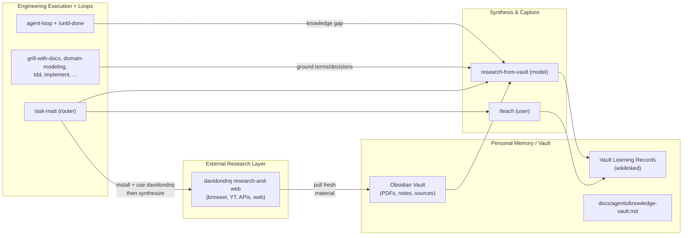

# Optimal Agent Brain

This repo + your personal vault + selective external skills form a practical "optimal brain" for agentic engineering and research.

See also `docs/OPTIMAL-BRAIN.md` for a fuller comparison to the original mattpocock/skills, the distinction from narrow Karpathy-style loops, and research/PhD-oriented guidance.

- **Long-term memory**: Your Obsidian vault (PDFs, notes, transcripts, learning records).
- **External sensing**: davidondrej/skills research-and-web (browser, YouTube, web, research APIs).
- **Synthesis & capture**: `research-from-vault` + `/teach` (with vault bridging).
- **Execution & loops**: mattpocock engineering skills + `agent-loop` / `/until-done` + verification discipline.
- **Routing**: `/ask-matt`.

## Layers



## Quickstart (combined stack)

1. Install this skills collection (the extended optimal brain):
   ```bash
   npx skills@latest add chidi/optimal-brain
   ```
   Select the skills you want (at minimum include `/setup-matt-pocock-skills`, `/setup-agent-loops`, `/ask-matt`, `/teach`).

2. In your repo or workspace:
   - `/setup-matt-pocock-skills`
   - `/setup-agent-loops` (for verification + stop rules on engineering work)
   - `/setup-knowledge-vault` (configures your Obsidian vault path, learning record bridging, PDF companions, and external ingestion flow)

3. For external research reach (optional but high leverage):
   ```bash
   npx skills@latest add davidondrej/skills
   ```
   Prefer the `research-and-web` category. Evaluate `agent-orchestration` and `thinking-and-docs` against what you already have here (overlap is common; pick the strongest per use case).

4. Restart Cursor (or new Agent chat). Use `/ask-matt` to discover flows.

## Reinstall / Verify in Cursor (after changes or first setup)

After adding or updating skills in the source:

```powershell
# Reinstall just the new vault skills (or all)
npx skills add chidi/optimal-brain -g -a cursor -y -s setup-knowledge-vault -s research-from-vault

# For external research reach (davidondrej)
npx skills add davidondrej/skills -g -a cursor
# During install, select the research-and-web skills (and others you want)
```

Then open a fresh Agent chat in Cursor and verify:
- `/ask-matt` surfaces the Knowledge, Research & Learning section.
- "research X using my vault" reaches `research-from-vault`.
- `/setup-knowledge-vault` is listed and runnable.
- New skills appear in the installed set (Cursor command palette or agent skill list).

Run structural checks in this repo:
```bash
bash scripts/list-skills.sh
```
All expected `SKILL.md` should be listed with no errors. Frontmatter on new skills must have valid `name` + `description`.


## Core Flows

- **Learning**: `/teach "topic"` → local workspace + (when vault configured) bridged vault learning records + wikilinked synthesis.
- **Research in vault**: "research X using my vault" or `/until-done Research X from the vault until synthesis note and learning record exist`.
- **Fresh world info → durable memory**: Use davidondrej research tools to fetch → save sources into vault (with companion notes) → `research-from-vault` or `/teach` to synthesize → vault learning record.
- **Engineering with memory**: `/grill-with-docs` or `domain-modeling` will ground in vault sources when present. Loops reach `research-from-vault` on knowledge gaps.
- **Maintenance**: `/loop 1d` + recipes from `setup-knowledge-vault/recipes/` (ingest, research, maintain indexes, external-to-vault).

## Key Config Files

- `docs/agents/loops.md` — verification, stop rules, scope for `agent-loop` / `/until-done` / `/implement`.
- `docs/agents/knowledge-vault.md` — vault path, learning record rules in vault, PDF handling, how skills consume it (written by `/setup-knowledge-vault`). See also `docs/agents/example-vault-learning-record.md` and `docs/agents/example-external-to-vault-synthesis.md` for sample bridged and external-to-vault synthesis outputs.
- `docs/agents/brain.md` (this file) — the big picture.

## Installation Order Recommendation

1. chidi/optimal-brain (engineering base + loops + teach + vault)
2. `/setup-matt-pocock-skills` + `/setup-agent-loops`
3. `/setup-knowledge-vault`
4. davidondrej/skills (selective: research-and-web first)

## Prefer Vault First

In any research or grounding task: vault sources (recency + your context + prior learning) before external. Use external tools to *fill gaps*, then immediately land and synthesize into the vault.

## Related

- [Extended Optimal Brain](../OPTIMAL-BRAIN.md) — fuller comparison, Karpathy distinction, and research guidance
- [Agent Loops](./loops.md)
- `skills/engineering/ask-matt/SKILL.md` (detailed routing)
- `skills/productivity/teach/` (MISSION, LEARNING-RECORD-FORMAT, RESOURCES-FORMAT)
- `skills/productivity/setup-knowledge-vault/` (setup + recipes)
- `skills/engineering/setup-agent-loops/` (loop recipes and discipline)
